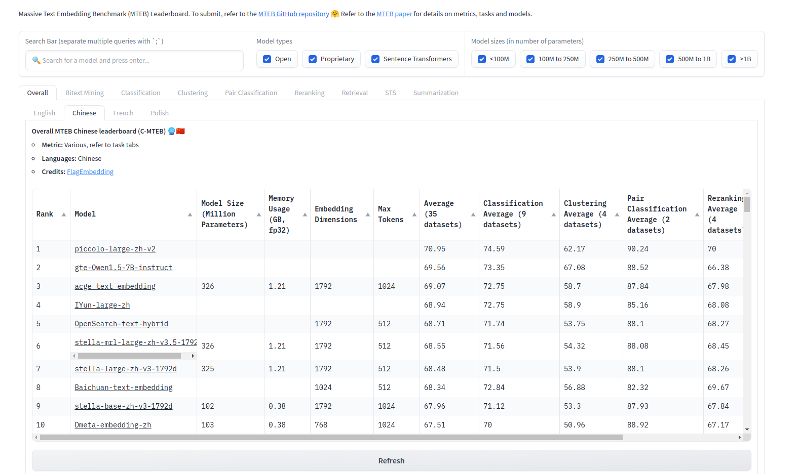

<small>[EN](README.md) | [简体中文](README_zh.md) </small>

# [Piccolo2: General Text Embeddings with Multi-Task Hybrid loss Training](https://arxiv.org/abs/2405.06932)

🚀 **New SOTA on CMTEB** 

🔥 Our general sentence embedding [sensenova/piccolo-large-zh-v2](https://huggingface.co/sensenova/piccolo-large-zh-v2) achieves SOTA on the CMTEB Leaderboard with an average score of 70.95. [2024/4/23]

<details>
<summary>📄 Results on CMTEB Leaderboard [click to expand]</summary>
<p align='center'>

</p>
</details>

## 💡Model Highlights
 Here we introduce Piccolo2, an embedding model that surpasses other models in the comprehensive evaluation over 6 tasks on CMTEB benchmark, setting a new state-of-the-art. Piccolo2 primarily leverages an efficient multi-task hybrid loss training approach, effectively harnessing textual data and labels from diverse downstream tasks. In addition, Piccolo2 scales up the embedding dimension and uses MRL training to support more flexible vector dimensions.

 For huggingface model, please refer to our space: https://huggingface.co/sensenova  
 For training details, please refer to our tech report: https://arxiv.org/abs/2405.06932

## 📖 Repo Details
 In this repo, we release our training code and implement some tricks that are helpful for embedding training, including:
- Multi-task Hybrid Loss Training
- Matryoshka Representation Learning
- Embdding Dimension Scaling
- Task-Homogenous Dataset
- Position Embedding Hierarchical Decomposition 
 
 In order to save memory, we default use deepspeed-zero1, gradient checkpointing and mix-precision for training. We also provide slurm scripts to help conduct distributed training.
 
### Tips
1. The repository will default to training using a multi-task hybrid loss, which is described in our technical report.

2. For embdding dimension scaling, we hard code the pretrain path, input dim and output dim in the code:
```python
self.scaling_layer = ScalingLayer(origin_dim=1024, scaling_dim=1792)
if os.path.exists(os.path.join(model_name_or_path, '2_Dense/pytorch_model.bin')):
    scaling_layer_state_dict = torch.load(os.path.join(model_name_or_path, '2_Dense/pytorch_model.bin'))
    self.scaling_layer.load_state_dict(scaling_layer_state_dict, strict=True)
```
3. For MRL training, we hard code the nesting list. Feel free to modify it by yourself.
```python
self.mrl_nesting_list = [256, 512, 768, 1024, 1280, 1536, 1792]
```

4. If you want to increase the length of the position embedding, set `extend_pe` to True and then set `max_length` to your expected length in the scripts.

## 🔨 Best Practice
### 1. Environment
```shell
pip install -r requirements.txt
```

### 2. Prepare Dataset
We divide the dataset into three major categories: retrieval/reranking, clustering/classification, abd sts/pair classification, and we adopt different loss functions for different categories. In `data_example` dir, we provide example for these three types of data.

1) `Retri`: For Retrieval and Reranking dataset, we implement standard InfoNCE with in-batch-negative, this dataset contain 4 columns: `text`, `text_pos`, `text_neg`, `type`. Here 'type' is 'retri_contrast'

2) `STS`: For STS and Pair-Classification dataset, we implement the cosent loss, this dataset contain 4 columns: `text`, `text_pair`, `label`, `type`. Here 'type' is 'cosent'
   
3) `Cls`: For Classification and Clustering dataset, we implement the InfoNCE w/o in-batch-negative, this dataset contain 4 columns: `text`, `text_pos`, `text_neg`, `type`. Here 'type' is 'cls_contrast'

The 'type' column indicates the type of the current dataset. We obtain the type of the current batch to apply different loss functions.

### 3. Training
We offer the training script located at `scripts/ft.sh`. Below we've provided explanations for the variables used within the script.

**Environment Variables**  
- ROOT: The absolute path of the repo in your machine. 
- GPUS_PER_NODE: Number of GPUs on a single machine
The default proviede scripts is for single-machine training. If you are in a multi-node distributed training scenario, you should additionally specify the env parameters below:
- WORLD_SIZE: Number of nodes
- RANK: rank of current node, it is often obtained thourgh the SLURM environment variable 
- MASTER_ADDR:MASTER_PORT: Communication port

**Training Variables** 
- MODEL_NAME_OR_PATH: the absolute path of the pretrain model
- DS_PATH: the deepspeed config, we provide a default config in `./de_config_zero1.json`
- META_PATHS: the list of the dataset. We provide a sample in `meta_lists/piccolo.txt`. Each row consists of two columns: the relative path of the dataset and the number of repeats.
- ROOT_DIRS: The absolute path of the dataset dir

**Run**
```shell
bash scripts/ft.sh
```

## 🤗 **Model List**
| Model|Language||Description|prompt|
|:-|:-:|:-:|:--------------------------------------------:|:---------:|
| [sensenova/piccolo-large-zh-v2](https://huggingface.co/sensenova/piccolo-large-zh-v2)                   |    Chinese     |   | version2: finetuning with multi-task hybrid loss training | None |
| [sensenova/piccolo-large-zh](https://huggingface.co/sensenova/piccolo-large-zh)                   |    Chinese     |   | version1: pretrain under 400 million chinese text pair | '查询'/'结果' |
| [sensenova/piccolo-base-zh](https://huggingface.co/sensenova/piccolo-base-zh)                   |    Chinese     |   | version1: pretrain under 400 million chinese text pair | '查询'/'结果' |


## Citation
If you find our tech report, models or code helpful, please cite our report or give a star on github or huggingface!  
```bibtex
@misc{2405.06932,
Author = {Junqin Huang and Zhongjie Hu and Zihao Jing and Mengya Gao and Yichao Wu},
Title = {Piccolo2: General Text Embedding with Multi-task Hybrid Loss Training},
Year = {2024},
Eprint = {arXiv:2405.06932},
}
```