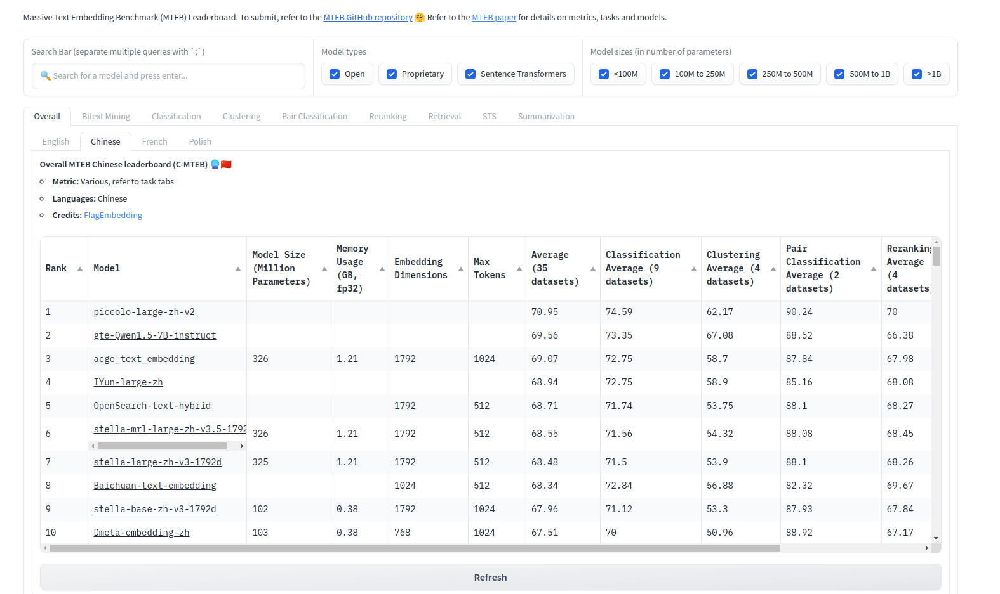

<small>[EN](README.md) | [简体中文](README_zh.md) </small>

# [Piccolo2: General Text Embeddings with Multi-Task Hybrid loss Training](https://arxiv.org/abs/2405.06932)

🚀 **New SOTA on CMTEB** 

🔥 我们最新的通用embedding模型 [sensenova/piccolo-large-zh-v2](https://huggingface.co/sensenova/piccolo-large-zh-v2) 在CMTEB评测榜单上取得了70.95的均分! [2024/4/23]

<details>
<summary>📄 CMTEB结果 [点击展开]</summary>
<p align='center'>

</p>
</details>

## 💡Model Highlights
Piccolo2 在CMTEB榜单上的6项任务的综合评估中超越了其他模型，目前位于第一位。Piccolo2 主要利用高效的多任务混合损失训练方法，有效地利用来自不同下游任务的文本数据和标签。 此外，Piccolo2 扩大了Embedding维度，并使用MRL训练来支持更灵活的向量维度。
huggingface上放了我们最新的模型: https://huggingface.co/sensenova  
对于训练细节，可以参考我们的技术报告: https://arxiv.org/abs/2405.06932

## 📖 Repo Details
在这个repo里面，我们放出了训练的代码，里面提供了一些有助于提升Embedding模型性能的训练技巧：
- Multi-task Hybrid Loss Training
- Matryoshka Representation Learning
- Embdding Dimension Scaling
- Task-Homogenous Dataset
- Position Embedding Hierarchical Decomposition 

为了节省内存，我们默认使用 deepspeed-zero1、gradient checkpointing和mix-precision进行训练。我们还提供了一个脚本用来帮助大家进行分布式训练。

### Tips
1. 该项目会默认使用multi-task hybrid loss来进行训练，前提是数据按规定格式准备好。

2. 对于scaling dimension length, 我们将它的一些参数写死在了代码里面, 请根据需要自行更改:
```python
self.scaling_layer = ScalingLayer(origin_dim=1024, scaling_dim=1792)
if os.path.exists(os.path.join(model_name_or_path, '2_Dense/pytorch_model.bin')):
    scaling_layer_state_dict = torch.load(os.path.join(model_name_or_path, '2_Dense/pytorch_model.bin'))
    self.scaling_layer.load_state_dict(scaling_layer_state_dict, strict=True)
```
3. 对于MRL训练, 我们也把它的参数写死在了代码里.
```python
self.mrl_nesting_list = [256, 512, 768, 1024, 1280, 1536, 1792]
```

4. 如果你想增长模型的position embedding，我们实现了一个简单的层次分解方法, 只需要将 `extend_pe` 设置为True 然后把 `max_length` 设置为你的目标长度就可以了.


## 🔨 使用指南
### 1. 环境
```shell
pip install -r requirements.txt
```

### 2. 数据准备
我们将数据集分为三大类：检索/排序、聚类/分类、句对相似度/句对分类，并对不同类别采用不同的损失函数。 在`data_example`目录中，我们提供了这三种类型数据的示例。

1) `Retri`: 对于检索、重排数据集, 我们采用标准的InfoNCE进行优化，同时采用in-batch-negative来扩充负样本数量。这个数据集需要四列: `text`, `text_pos`, `text_neg`, `type`. 这里的 'type' 需要被标注为 'retri_contrast'。

2) `STS`: 对于句对相似度，句对分类数据集, 我们采用了cosent这种排序损失, 这个数据集同样有四列: `text`, `text_pair`, `label`, `type`. 这里 'type' 需要被标注为 'cosent'。
   
3) `Cls`: 对于分类、聚类任务, 我们将文本和它的语义标签视为正负样本对，同样采用了InfoNCE损失来优化，但不再采样in-batch-negative（因为这很容易造成训练冲突）,这类数据集同样包含四列: `text`, `text_pos`, `text_neg`, `type`. 这里 'type' 需要被标注为 'cls_contrast'

'type' 列表明了当前数据的类型，在训练的时候，我们通过获取当前数据的类型，以采用不同的损失进行优化。

### 3. 训练
我们提供了训练的脚本 `scripts/ft.sh`. 下面我们对这个脚本里的一些变量做了简单的解释.

**环境参数**  
- ROOT: 为该项目在本地机器上的绝对路径. 
- GPUS_PER_NODE: 单卡的GPU数量
默认提供的脚本是在单机下进行训练的，如果你是在多机多卡下进行分布式训练，你需要额外填上:
- WORLD_SIZE: 机器的数量
- RANK: 当前机器的Rank序号，通常需要从SLURM的环境变量获取
- MASTER_ADDR:MASTER_PORT: 通信端口


**训练参数** 
- MODEL_NAME_OR_PATH: pretrain model的绝对路径。
- DS_PATH: deepspeed参数, 默认的config放在了 `./de_config_zero1.json`。
- META_PATHS: 使用的数据集列表. 我们提供了一个样本 `meta_lists/piccolo.txt`. 该txt文件的每一行有两列，第一列是数据集的相对路径，第二列是数据集的repeat次数。
- ROOT_DIRS: 数据集的目录的绝对路径。

**Run**
```shell
bash scripts/ft.sh
```

## 🤗 **Model List**
| Model|语言||简介|prompt|
|:-|:-:|:-:|:--------------------------------------------:|:---------:|
| [sensenova/piccolo-large-zh-v2](https://huggingface.co/sensenova/piccolo-large-zh-v2)                   |    Chinese     |   | version2: 采用了多任务混合损失进行训练 | None |
| [sensenova/piccolo-large-zh](https://huggingface.co/sensenova/piccolo-large-zh)                   |    Chinese     |   | version1: 使用4亿的中文pair对进行预训练 | '查询'/'结果' |
| [sensenova/piccolo-base-zh](https://huggingface.co/sensenova/piccolo-base-zh)                   |    Chinese     |   | version1: 使用4亿的中文pair对进行预训练 | '查询'/'结果' |


## Citation
如果您认为我们的技术报告、模型、代码有帮助，请像下面这样引用我们的文章，或者在github和huggingface上点一个免费的赞！
```bibtex
@misc{2405.06932,
Author = {Junqin Huang and Zhongjie Hu and Zihao Jing and Mengya Gao and Yichao Wu},
Title = {Piccolo2: General Text Embedding with Multi-task Hybrid Loss Training},
Year = {2024},
Eprint = {arXiv:2405.06932},
}
```